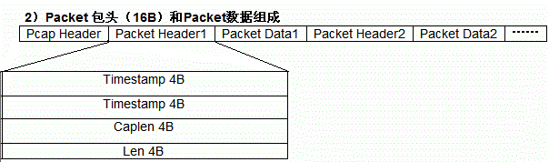

## Pcap文件的数据结构

pcap文件的格式为：

  文件头（24字节）

  数据包头（16字节） + 数据包（点云数据包） 

  数据包头（16字节） + 数据包（点云数据包）......

如下图所示：


PcapHeader每个文件只有一个，它定义了本文件的读取规则、最大储存长度限制等内容；这些数据现一般对我们来说对我们来说是不用的

Magic：4Byte：标记文件开始，并用来识别文件自己和字节顺序。0xa1b2c3d4用来表示按照原来的顺序读取，0xd4c3b2a1表示下面的字节都要交换顺序读取。
考虑到计算机内存的存储结构，一般会采用0xd4c3b2a1，即所有字节都需要交换顺序读取。
- Major：2Byte： 当前文件主要的版本号，一般为 0x0200【实际上因为需要交换读取顺序，所以计算机看到的应该是 0x0002】
- Minor：2Byte： 当前文件次要的版本号，一般为 0x0400【计算机看到的应该是 0x0004】
- ThisZone：4Byte：当地的标准时间，如果用的是GMT则全零，一般都直接写 0000 0000
- SigFigs：4Byte：时间戳的精度，设置为 全零 即可
- SnapLen：4Byte：最大的存储长度，如果想把整个包抓下来，设置为 ffff 0000，但一般来说 ff7f 0000就足够了【计算机看到的应该是 0000 ff7f 】
- LinkType：4Byte：链路类型，常用类型有以下几种，其他的，需要用的时候再查就行了

数据包头为16字节，后面紧跟数据包，这里的数据包就是我们在产品手册中所说的点云数据包（数据包以42位以太网包头开始），用wireshark直接去读pcap文件，
显示的值一般从42位以太网包头开始。由于我们是使用udp里的时间戳，前8位时间戳一般可以不用。后8位包长度，可以用来确定我们的数据包长度，判断 数据是否是我
们想要的，以及确定雷达种类

- Timestamp：被捕获时间的高位，单位是seconds
- Timestamp：被捕获时间的低位，单位是microseconds
- Caplen：当前数据区的长度，即抓取到的数据帧长度，不包括Packet Header本身的长度，单位是 Byte ，由此可以得到下一个数据帧的位置。
- Len：离线数据长度：网络中实际数据帧的长度，一般不大于caplen，多数情况下和Caplen数值相等

由于我们只需要udp包里的数据，所以pcap文件读取时，可以根据以上格式直接按2进制的方式读取文件（with open(file,'rb') as filehandle)大大加快文件
读取和解析速度。反过来，我们通过socket接口读取到的pcap文件，也可以根据以上规则进行打包，存成可以用PandarView可以读取的pcap文件。

用socket接口读取的数据是一个set，其中第0个元素即是不包括42位以太网包头的UDP数据包，所以将socket读取的数据存为pcap文件，首先需要加上24位文件头，
然后每个udp数据包前打上16位数据包头+42位以太网包头即可，注意16位数据包头的后8位需正常填入包的长度，以便后期解析。

使用以下python脚本去读取一个pcap文件：

```python
import struct

input_file = r"D:\WORK\0_QT128相关\QT128_四色板.pcap"
file_handle = open(input_file, 'rb')
datas=''
for j in range(16):
    for i in range(8):  # 读取16行，每行8个字节
        data = file_handle.read(1)
        data_hex = str(hex(struct.unpack('<B', data)[0]))[2:]
        if len(data_hex) == 1:
            data_hex = '0'+data_hex
        datas += data_hex
    datas +='\n'

print(datas)

"""
d4c3b2a102000400
0000000000000000
ffff000001000000
f8240000816b0d00
9104000091040000
ffffffffffff000a
35001e5308004500
04837af140004011
f880c0a801c9ffff
ffff27100940046f
0000eeff03020000
80020104021df848
6c011f006f012100
7a01220086012000
91011c0096011c00
a1011c00ab011c00
"""
```

数据结果划分如下：
```python
#####文件包头（24位）#####
d4c3b2a102000400
0000000000000000
ffff000001000000

#####数据包头（16位）#####
f8240000816b0d00
9104000091040000

####wireshark显示数据####
##点云数据包：以太网包头（42位）###
ffffffffffff000a
35001e5308004500
04837af140004011
f880c0a801c9ffff
ffff27100940046f
0000

###点云数据包：UDP数据###
    eeff03020000
80020104021df848
6c011f006f012100
7a01220086012000
91011c0096011c00
a1011c00ab011c00
```