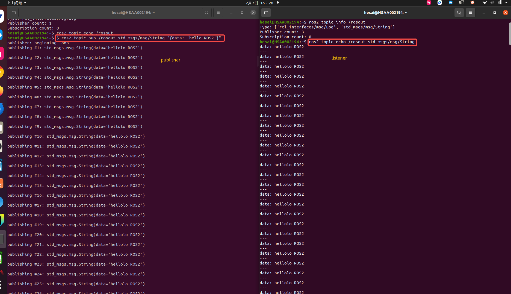
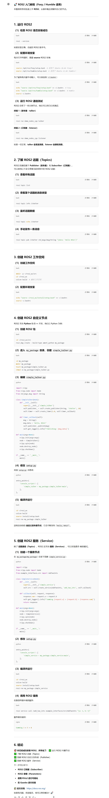

## 1. 配置环境变量
每次打开终端时，需要source ROS2 环境
```bash

source /opt/ros/foxy/setup.bash
```

## 2. 运行ROS2通信测试（demo）
终端1（发布者 - talker）
```bash

ros2 run demo_nodes_cpp talker
```

终端2（订阅者 - listener）
```bash

ros2 run demo_nodes_cpp listener
```

# 了解ROS2话题(Topics)

ROS2的通信基于**publisher发布者** 和 **subscriber订阅者**。

常用话题命令

- 查看所有话题
```bash

ros2 topic list
```

- 查看某个话题的消息类型
```bash

ros2 topic info /chatter 
```

- 监听话题数据
```bash

ros2 topic echo /chatter 
```

- 手动发布一条信息
```bash
 
ros2 topic pub /chatter std_msgs/msg/String "{data: 'Hello ROS2'}"
```




# 创建ROS2工作空间

- 创建工作空间
```bash

mkdir -p ~/ros2_ws/src
cd ~/ros2_ws
colcon build  # 编译工作空间 
```

- 配置环境变量
```bash

echo "source ~ros2_ws/install/setup.bash" >> ~/.bashrc
source ~/.bashrc
```




