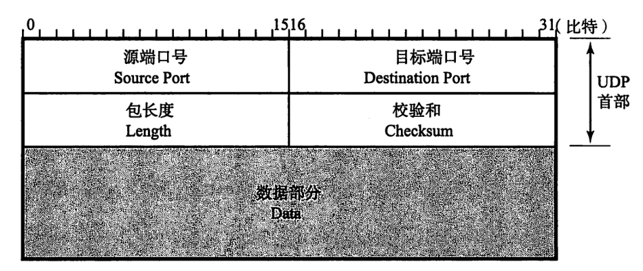

## 协议
### OSI： Open Systems Interconnection

### IPv4 首部

- 版本（Version）

IPv4 为4
IPv6 为6
  
- 首部长度（IHL：Internet Header Length）

单位为4字节
没有可选字段的话，首都长度为"5", 即长度为4×5=20字节

### UDP首部的格式

共8个字节

### TCP首部格式

- 源端口号
- 目标端口号
- 序列号（Sequence Number）：字段长度4 Bytes。序列号是指发送数据的位置，每发送一次数据，就累加一次该数据字节数的大小。  序列号不会从0或1开始，而是在
建立连接时由计算机生成的随机数作为其初始值，通过SYN包传给接收端主机。然后再将没转发过去的字节数（不包含TCP首部）累加到初始值上表示数据的位置。此外，在
  建立连接和断开连接时发送SYN包和FIN包虽然并不携带数据，但是也会作为一个字节增加对应的序列号。
- 确认应答号（Acknowledgment Number）：确认应答号字段长度4 Bytes。是指下一次应该收到的数据的序列号（对应对方发过来的序列号）。实际上，它是指：
已经收到该确认应答号减1为止的所有数据。发送端收到这个确认应答号以后可以认为在这个序号以前的数据都已被正常接收了。
- 数据偏移（Data Offset）= Header Length TCP首部长度，单位为4个字节。4 bits
- Reserved
- 控制位（Control Flag）： 

- 窗口大小
- 校验和
  
## TCP
TCP连接的建立与断开

## 集线器、交换机、路由器
注：我们家里用的路由器已经集成了集线器和交换机的功能

网卡中的PHY模块负责将包转成电信号，信号通过RJ-45接口进入双绞线。以太网信号的本质是正负变化的电压。

RJ-45接口如下：

### 集线器
集线器将信号发往所有现路，广播到整个网络中。

信号到达集线器的PHY模块后，会进入中继电路。中继电路的基本功能就是将输入的信号广播到集线器的所有端口上。

### 交换机
交换机根据地址表进行转发

交换机的每个网线接口后面都是一块网卡，网线接口和后面的电路部分加在一起称为一个端口，单盒网卡不同，交换机的端口不具有MAC地址。

交换机根据MAC地址表查找MAC地址，然后将信号发送到相应的端口。

### 路由器
路由器是基于IP设计的，而交换机是基于以太网设计的。

路由器的端口具有MAC地址，它是以太网的发送方和接收方。

端口还具有IP地址。

路由器会忽略主机号，只匹配网络号。

路由表的子网掩码列只表示在匹配网络包目标地址时需要对比的比特数量。

通过路由器转发的网络包，其接收方MAC地址为路由器端口的MAC地址。

路由表中子网掩码为0.0.0.0的记录表示“默认路由”。

路由器的发送操作：为了判断MAC头部中的MAC地址应该填写什么值，我们需要根据路由表的网关列判断对方的地址。如果网关是一个IP地址，则这个IP地址就是我们要
转发到的目标地址；如果网关为空，则IP头部中的接受方IP地址就是要转发到的目标地址。知道对方的IP地址之后，接下来需要通过ARP根据IP地址查询MAC地址，并将
查询的结果作为接收方MAC地址。

路由器也会使用ARP来查询下一个转发目标的MAC地址。

路由器的地址转换原理：

对外只有一个公有地址的情况下，通过不同的端口号来区别内网中的不同终端。

互联网接入路由器会在网络包前面加上MAC头部、PPPoE头部、PPP头部总共3种头部，然后发送给Modem（猫）

