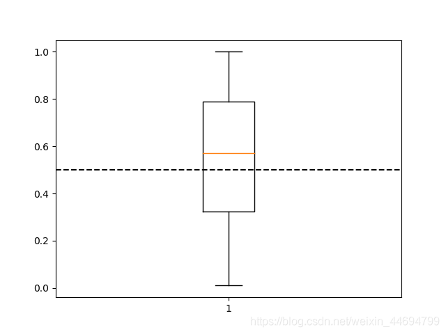

```python
import numpy as np
import matplotlib.pyplot as plt

data = np.random.random((100, 1))
plt.boxplot(data)
axes = plt.gca()
left, right = axes.get_xlim()
axes.hlines(y=0.5, xmin=left, xmax=right, linestyles='dashed')  # 画真值横线

plt.show()
```


