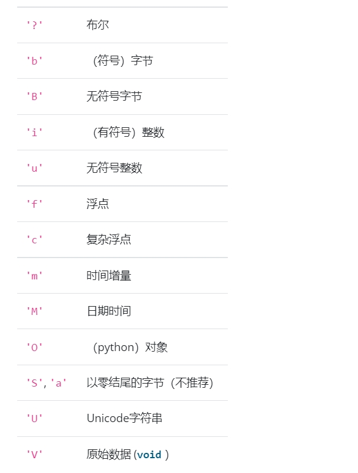

## 数组类型对象
### 数组协议类型字符串
第一个字符指定数据的类型，其余字符指定每个项目的字节数。


```python
dt = np.dtype('i4')   # 32-bit signed integer
dt = np.dtype('f8')   # 64-bit floating-point number
dt = np.dtype('c16')  # 128-bit complex floating-point number
dt = np.dtype('a25')  # 25-length zero-terminated bytes
dt = np.dtype('U25')  # 25-character string
```