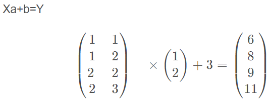

```python
lr = sklearn.linear_model.LinearRegression(fit_intercept=True, normalize=False, copy_X=True, n_jobs=1)
```
返回一个线性回归模型，损失函数为误差均方函数。
其中：

 - fit_intercept：默认True，是否计算模型的截距；为False时，则数据中心化处理；
 - normalize：默认False，是否中心化；
 - copy_X：默认True，否则X会被改写；
 - n_jobs：默认为1，表示使用CPU的个数。当-1时，表示使用全部CPU。

调用方法：

 - coef_：训练后的输入端模型系数；
 - intercept_：截距
 - predict(x)：预测数据
 - score：评估

```python
from sklearn.linear_model import LinearRegression
import numpy as np

data1 = np.array([1, 2, 3]).reshape((3, 1))  # X必须是一个2维数组(稀疏矩阵)。
data2 = [2, 4, 6]
X = data1
Y = data2
# Y = aX + b
lr = LinearRegression()
lr.fit(X, Y)
print(data1)
print(lr.coef_, lr.intercept_)

"""
[[1]
 [2]
 [3]]
[2.] 8.881784197001252e-16
"""
```
```python
import numpy as np
from sklearn.linear_model import LinearRegression
X = np.array([[1, 1], [1, 2], [2, 2], [2, 3]])
# y = 1 * x_0 + 2 * x_1 + 3
y = np.dot(X, np.array([1, 2])) + 3  #矩阵点乘，所以X必须是二维数组。
reg = LinearRegression().fit(X, y)
reg.score(X, y)
print(reg.coef_)
print(reg.intercept_)
print(reg.predict(np.array([[3, 5]])))

结果：
"""
[6 8 9 11]
[1. 2.]
3.000000000000001
[16.]
"""
```



