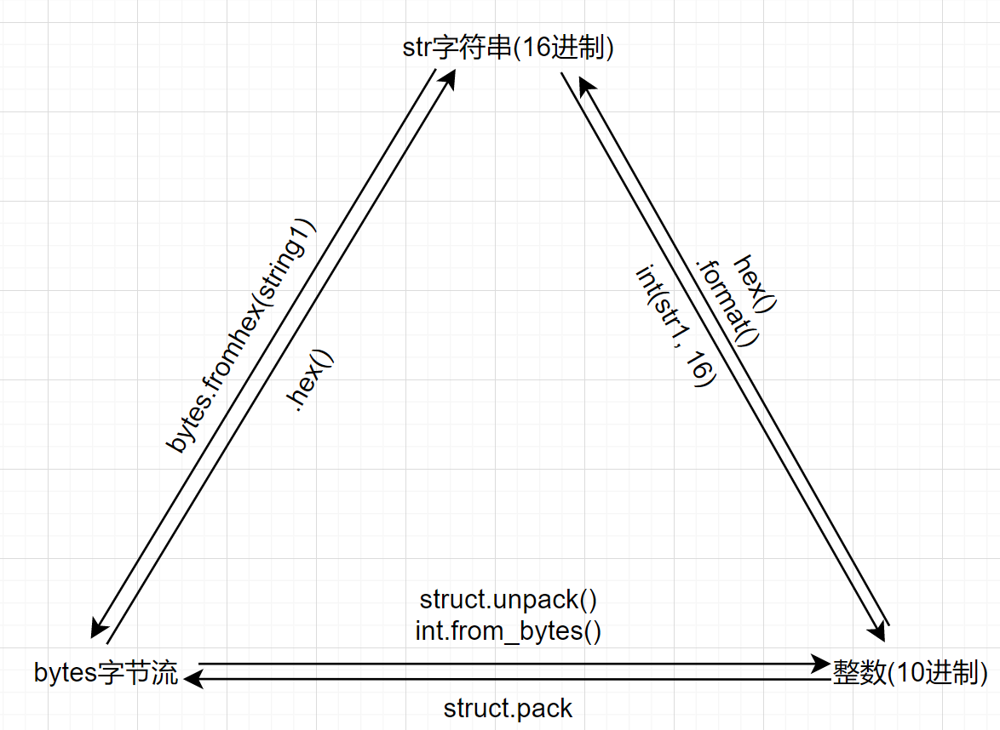
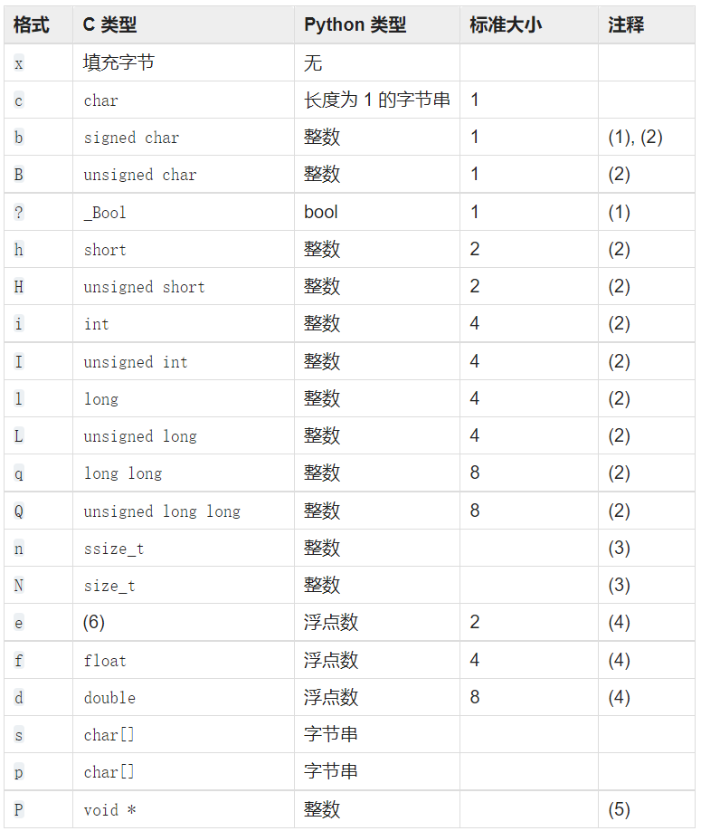

### 字符串和字节流的相互转换
```python
string1 = 'aabbcc0102ff'
bits = bytes.fromhex(string1)  # 字符串转化为字节流
print(type(bits), bits)

string2 = bits.hex()  # 字节流转化为字符串
print(type(string2), string2)

结果
"""
<class 'bytes'> b'\xaa\xbb\xcc\x01\x02\xff'
<class 'str'> aabbcc0102ff
"""
```

### 10进制整数转化为16进制字符串
```python
a = hex(255)
b = hex(256)
print(type(a), a)
print(type(b), b)

"""
<class 'str'> 0xff
<class 'str'> 0x100
"""
```
#### 注：hex()转化的弊端：16以下就会只占一个位置
可以使用format()方法
整数=>字符串=>字节流
```python
b = 256
str1 = '0x{:04x}'.format(b)
print(type(str1), str1)
bits = bytes.fromhex(str1[2:])
print(type(bits), bits)

"""
<class 'str'> 0x0100
<class 'bytes'> b'\x01\x00'
"""
```

```python
s1 = '{:#08x}'.format(15)
s2 = '{:#8x}'.format(15)

s3 = '0x{:08x}'.format(15)
s4 = '0x{:8x}'.format(15)

print(' s1: {}\n'.format(s1),
      's2: {}\n'.format(s2),
      's3: {}\n'.format(s3),
      's4: {}\n'.format(s4))

"""
 s1: 0x00000f
 s2:      0xf
 s3: 0x0000000f
 s4: 0x       f
"""

```

### 整数直接转为字节流(使用struct.pack)
```python
import struct

raw_cmd_code = 256
cmd_code1 = struct.pack('>H', raw_cmd_code)
cmd_code2 = struct.pack('<H', raw_cmd_code)
print(type(cmd_code1), cmd_code1)
print(type(cmd_code2), cmd_code2)

print(struct.pack('<2H', 1, 255))
print(struct.pack('<LL', 1, 255))

结果
"""
<class 'bytes'> b'\x01\x00'
<class 'bytes'> b'\x00\x01'
b'\x01\x00\xff\x00'
b'\x00\x00\x00\x01\x00\x00\x00\xff'
"""
```

```python
raw_cmd_code = 256
print(raw_cmd_code.to_bytes(2, 'big'))
print(raw_cmd_code.to_bytes(2, 'little'))

"""
b'\x01\x00'
b'\x00\x01'
"""
```




### 字节流直接转化为整数(使用struct.unpack)
```python
import struct
bits = b'\x01\02'
a = struct.unpack('<h', bits)
b = struct.unpack('>h', bits)
c = struct.unpack('<2B', bits)
d = struct.unpack('>BB', bits)
print(type(a), a[0])  # unpack函数返回tuple
print(type(b), b[0])
print(type(c), c)
print(type(d), d)

"""
<class 'tuple'> 513
<class 'tuple'> 258
<class 'tuple'> (1, 2)
<class 'tuple'> (1, 2)
"""
```

### 字节流转化为整数
```python
bits = b'\x01\x02'
a = int.from_bytes(bits, byteorder='big')
b = int.from_bytes(bits, 'little')
print(type(a), a)
print(type(b), b)

"""
<class 'int'> 258
<class 'int'> 513
"""
```

### 字符串转化为整数
```python
a = '0xff'
b = '1ff'
print(int(a, base=16))
print(int(b, base=16))

"""
255
511
"""
```